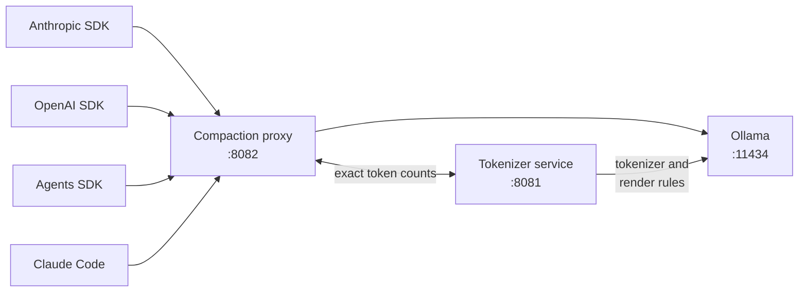
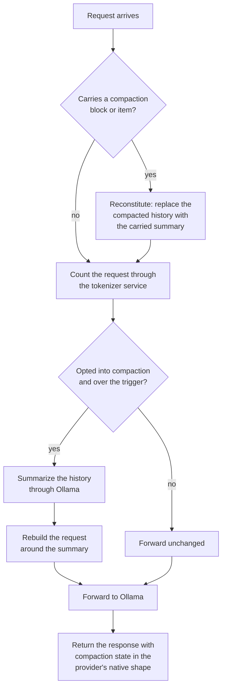
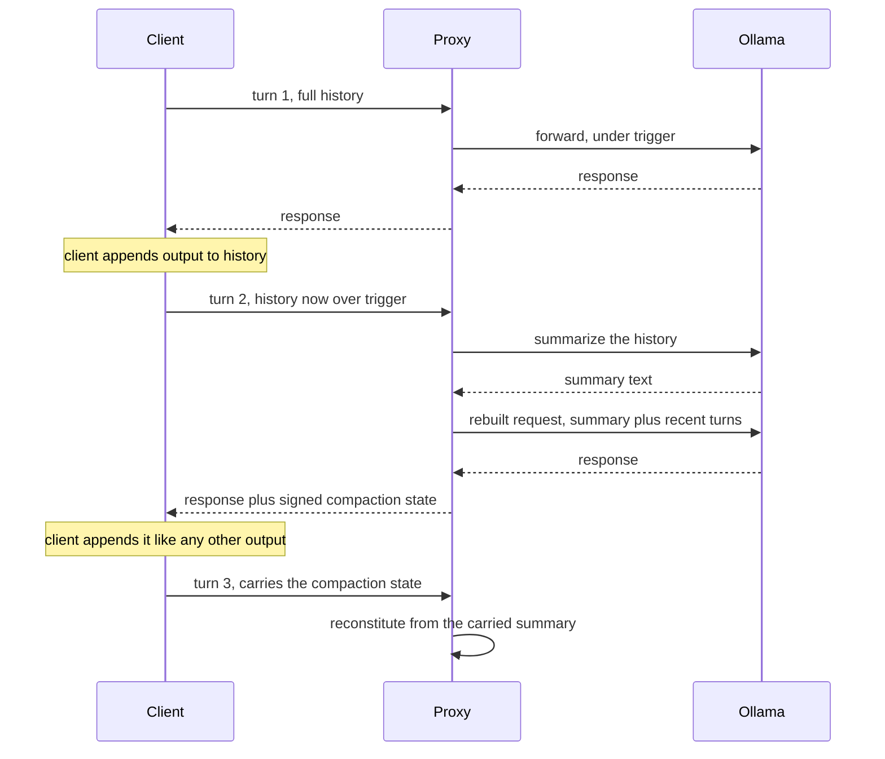
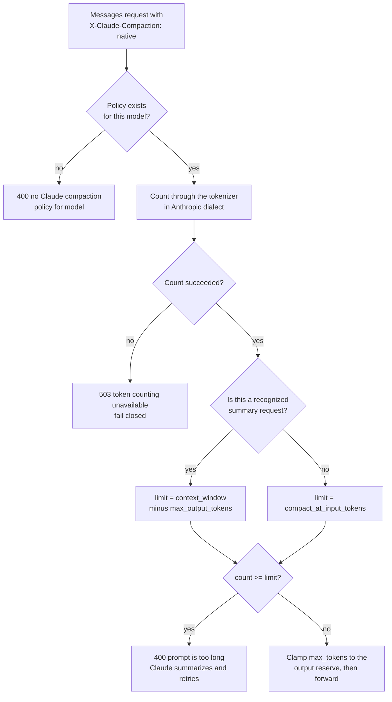

# Ollama compaction proxy

This proxy gives locally hosted Ollama models native, server-side context compaction. The official Anthropic and OpenAI SDKs talk to it unmodified.

It speaks two wire protocols:

- Anthropic Messages at `/v1/messages`, using the `compact-2026-01-12` beta contract: `context_management.edits` with `compact_20260112`, the `compaction` content block, `compaction_delta` streaming, `stop_reason: "compaction"` and `usage.iterations`
- OpenAI Responses at `/v1/responses`, using `context_management: [{"type":"compaction","compact_threshold":N}]`, the `compaction` output item, the `compaction_trigger` input item and the standalone `POST /v1/responses/compact` endpoint

The proxy sits in front of Ollama's own compatibility endpoints. Ollama 0.32 and later serves both dialects natively, so this is compaction middleware, not a protocol translator. Requests that need no compaction pass through byte for byte.



## Repository layout

The repository holds two independent Go modules. They deploy as separate systemd units on the same host and talk over loopback.

| Path | Module | Port | What it does |
|---|---|---|---|
| `.` | `github.com/andyjmorgan/ollama-compaction-proxy` | 8082 | this proxy: compaction on both wire protocols |
| `tokenizer-service/` | `.../tokenizer-service` | 8081 | [exact token counts](tokenizer-service/README.md) from the model's own tokenizer |

Each module builds and tests from its own directory with `go test ./...`. The nested module sits outside the root module's package tree, so the two stay independent.

## How compaction works

The proxy inspects every request, counts it, and summarizes only when the count crosses the client's trigger.



The four steps in words:

1. The proxy reconstitutes any round-tripped compaction state. It replaces the compacted history with the carried summary before the model sees anything.
2. It counts the rebuilt request through the tokenizer service, after dialect normalization and model-specific rendering.
3. If the request opted into compaction and the count crosses the trigger, the proxy summarizes the history through Ollama. It uses `COMPACT_MODEL`, or the request's own model when that is unset.
4. The response carries the compaction state in the provider's native shape.

## Statelessness contract

The proxy stores nothing. Everything rides the message contract, so the client's ordinary append-output-to-input loop round-trips the state.



The proxy rejects `previous_response_id` and `conversation` with a clear 400. It accepts `store` and ignores it.

```python
# OpenAI and Agents SDK
client = OpenAI(base_url="http://spark:8082/v1", api_key="unused")
r = client.responses.create(model="gemma4:e4b", store=False, input=history,
    extra_body={"context_management": [{"type": "compaction", "compact_threshold": 8000}]})
history += [item.model_dump(exclude_unset=True) for item in r.output]

# Anthropic SDK
client = anthropic.Anthropic(base_url="http://spark:8082", api_key="unused")
r = client.beta.messages.create(model="gemma4:e4b", max_tokens=1000,
    betas=["compact-2026-01-12"],
    context_management={"edits": [{"type": "compact_20260112",
                                   "trigger": {"type": "input_tokens", "value": 8000}}]},
    messages=history)
history.append({"role": "assistant", "content": [b.model_dump(exclude_unset=True) for b in r.content]})
```

### How the state stays trustworthy

The `encrypted_content` field is `base64url(JSON ‖ HMAC-SHA256)`. The proxy signs it rather than encrypting it. The payload is the client's own conversation summary, so what matters is rejecting tampered or foreign state, not hiding the text.

Each dialect handles a bad blob differently, because the consequences differ:

- Anthropic falls back to the block's client-visible plaintext `content`. If that is null too, the block becomes a no-op and the full history is kept. This matches Anthropic's own failed-compaction semantics.
- OpenAI returns a 400. There, `encrypted_content` is the only carrier of the compacted context, so dropping it silently would produce amnesiac answers.

## Native Claude compaction

Claude Code and the Claude Agent SDK compact on the client side. That is a different contract from the server-side compact edit above, so it has its own opt-in path.

Turn it on with the `X-Claude-Compaction: native` request header and a policy file in `CLAUDE_MODEL_POLICY_FILE`. The proxy then stops summarizing behind Claude's back. Instead it counts each request and returns a standard `prompt is too long` error at the model's budget, which drives Claude's own reactive summary. The session continues, including native subagents that inherit the parent window.



Three details matter here:

- summary requests get the full physical window minus the output reserve. Without that carve-out, compaction itself could be refused and the session would deadlock.
- the overflow error carries no token-gap hint, deliberately. A hint makes Claude truncate history instead of summarizing. Token counts stay accurate in the logs.
- counting outages fail closed on this path. Requests without the header keep their previous behavior.

Summary recognition is compatibility logic, not an authentication boundary. It never bypasses the physical context reserve.

### Reading the policy from a client

`GET /v1/compaction/models` returns the configured serving windows, output limits and compaction budgets. `GET /v1/models` returns the same thing when you reach the proxy directly.

In Claude 2.1.269, generic gateway discovery through `/v1/models` is only a picker facility and ignores the context fields. Your application has to read the explicit policy endpoint and configure the runtime itself. A process-global window cannot represent mixed Qwen and Gemma limits, so the proxy applies each model's own budget per request.

Runtime compatibility is pinned to Claude Code 2.1.269. Rerun the native SDK compaction acceptance test before upgrading. The validated application and test harness live in `/home/localuser/source/anthropic-agent-sdk-example`.

## Configuration

### Environment variables

| Variable | Default | What it controls |
|---|---|---|
| `LISTEN_ADDR` | `:8082` | listen address |
| `OLLAMA_URL` | `http://127.0.0.1:11434` | upstream Ollama |
| `TOKENIZER_URL` | `http://127.0.0.1:8081` | the tokenizer service |
| `CLAUDE_MODEL_POLICY_FILE` | unset | path to the native Claude policy file, described below |
| `COMPACT_PROMPT_FILE` | unset | path to a file holding your own summarization prompt |
| `COMPACT_MODEL` | the request's model | a dedicated summarizer model |
| `MODEL_PREFIX` | `agent/` | routing prefix stripped from model names; empty disables it |
| `COMPACT_HMAC_KEY` | random per boot, with a warning | signs compaction state; persist it |
| `COMPACT_DEFAULT_TRIGGER_ANTHROPIC` | `150000` | used when the edit carries no trigger |
| `COMPACT_DEFAULT_THRESHOLD_OPENAI` | `200000` | used when the entry carries no threshold |
| `COMPACT_MIN_TRIGGER` | `1024` | floor on client-supplied triggers |
| `MAX_BODY_BYTES` | `67108864` | request body cap |
| `SUMMARIZE_TIMEOUT` | `5m` | summarization call timeout |
| `UPSTREAM_TIMEOUT` | `10m` | non-streaming upstream timeout |
| `LOG_LEVEL` | `info` | log verbosity |

Persist `COMPACT_HMAC_KEY` across restarts. If you do not, clients holding older compaction state will have it rejected. The deploy script generates one into `/etc/ollama-compaction-proxy/env` on first install.

### Adding a model

Most models need no configuration at all. Any model Ollama serves works through the proxy already, because `MODEL_PREFIX` strips the routing prefix and the model name passes straight through. Server-side compaction on the Anthropic and OpenAI paths takes its trigger from the request, not from a policy file.

You only add a policy entry to put a model on the native Claude path, where the proxy enforces a budget instead of summarizing.

First, check that the tokenizer renders the model properly. Counts on a badly rendered model are worthless, and nothing else warns you:

```console
curl -s http://ollama-host:8081/count-tokens \
  -d '{"model":"gemma4:e4b","messages":[{"role":"user","content":"probe"}]}'
ssh ollama-host 'sudo journalctl -u ollama-tokenizer -n 1 -o cat'
```

Look at `render_tier` in that log line. A value of `renderer` or `template` is good. A value of `concat` means the model fell back to plain concatenation and undercounts by 30% to 65%, so do not give it a policy until that is fixed.

Second, read the model's real context window from Ollama rather than guessing:

```console
curl -s http://ollama-host:11434/api/show -d '{"model":"gemma4:e4b"}' \
  | python3 -c 'import json,sys; mi=json.load(sys.stdin)["model_info"]; \
    print({k:v for k,v in mi.items() if k.endswith("context_length")})'
```

That returns `{'gemma4.context_length': 131072}`, which is the number to use for `context_window`.

Third, add the entry to `deploy/claude-models.json`. Each key is the real Ollama model ID, without the routing prefix.

```json
{
  "qwen3.6:35b-a3b": {
    "context_window": 262144,
    "max_output_tokens": 8192,
    "compact_at_input_tokens": 230000
  },
  "muse-glimmer:latest": {
    "context_window": 131072,
    "max_output_tokens": 8192,
    "compact_at_input_tokens": 110000,
    "summary_thinking": "enabled"
  }
}
```

| Field | Required | Meaning |
|---|---|---|
| `context_window` | yes | the physical context the model serves |
| `max_output_tokens` | yes | output reserve; the proxy clamps a larger `max_tokens` down to this |
| `compact_at_input_tokens` | yes | the budget at which Claude is told to compact |
| `summary_thinking` | no | `enabled` or `disabled`, applied to summary requests only |

Leave headroom between `compact_at_input_tokens` and the physical window. The shipped entries sit about 12% below it, which leaves room for the summary request that compaction itself sends.

The proxy validates every policy at startup and refuses to start if one is wrong. The rules are:

- `compact_at_input_tokens` is at least 1024
- `max_output_tokens` is at least one
- `context_window` is greater than `max_output_tokens`
- `compact_at_input_tokens` is below `context_window` minus `max_output_tokens`
- `summary_thinking`, when present, is exactly `enabled` or `disabled`

Fourth, deploy. The script installs the file to `/etc/ollama-compaction-proxy/claude-models.json` and restarts the service, which reads the file once at startup.

```console
./deploy/deploy.sh
curl -s http://ollama-host:8082/v1/compaction/models | python3 -m json.tool
```

The catalog should list your model. Editing the installed file directly also works for a quick test, but the next deploy overwrites it, so put the change in the repo.

A model that needs reasoning to summarize reliably sets `summary_thinking: enabled`, as `muse-glimmer:latest` does. That setting overrides the client's thinking default for summary requests only, and the proxy applies it before counting. Ordinary inference keeps the client or model setting.

### Changing the summarization prompt

The proxy ships a built-in summarization prompt, `DefaultInstructions` in `internal/summarize/prompt.go`. It tells the summarizer to capture the goal, the decisions and exact identifiers, the useful tool results, the current state and the pending task.

Three sources can supply the prompt. The first one that is non-blank wins:

1. The caller's own instructions, sent in the request. The Anthropic contract makes these a full replacement, not an addition, so they override everything.
2. Your house prompt, from the file named by `COMPACT_PROMPT_FILE`.
3. The built-in `DefaultInstructions`.

To set a house prompt, write the file and point the service at it:

```console
sudo tee /etc/ollama-compaction-proxy/compact-prompt.txt >/dev/null <<'PROMPT'
You are compacting a long conversation so it can continue in less context.
Keep every command, file path, and identifier exactly as written.
PROMPT
echo 'COMPACT_PROMPT_FILE=/etc/ollama-compaction-proxy/compact-prompt.txt' \
  | sudo tee -a /etc/ollama-compaction-proxy/env >/dev/null
sudo systemctl restart ollama-compaction-proxy
```

The unit already loads `/etc/ollama-compaction-proxy/env`, and deploys do not overwrite it. The proxy refuses to start if the file is missing or blank, so a typo fails loudly rather than silently reverting to the default.

The prompt is the largest single lever on compaction quality. Test a change against a real conversation before you rely on it.

### Pointing at a different tokenizer

Set `TOKENIZER_URL`. The proxy calls `POST /count-tokens` on that service and sends `X-Tokenizer-Dialect: anthropic` for Messages requests.

That header matters. Generic flattening loses tool names, tool schemas, call and result structure, and thinking blocks, all of which cost real tokens. In the lab, one tool-bearing request counted 271 tokens flattened and 344 tokens in Anthropic dialect.

The tokenizer service has its own settings. See the [tokenizer service configuration](tokenizer-service/README.md#configuration).

## Endpoints

| Endpoint | Behavior |
|---|---|
| `GET /v1/compaction/models` | configured native Claude policies |
| `GET /v1/models` | the same catalog, for direct callers |
| `POST /v1/messages` | Anthropic dialect plus compaction |
| `POST /v1/messages/count_tokens` | implemented by the proxy, since Ollama has none; substitution-aware |
| `POST /v1/responses` | OpenAI dialect plus compaction |
| `POST /v1/responses/compact` | standalone client-driven compaction |
| `POST /v1/chat/completions` | byte passthrough with a stream watchdog; no compaction |
| `GET /health` | proxy, Ollama and tokenizer reachability |

### Request headers

| Header | Values | Effect |
|---|---|---|
| `X-Claude-Compaction` | `native` | opts into the native Claude budget path |
| `X-Ollama-Thinking` | `disabled` | restores disabled thinking when Claude omits the field for an unfamiliar model |
| `X-Ollama-Summary-Thinking` | `disabled` | same, but for summary requests only, so ordinary tasks keep their default |
| `X-Claude-Code-Session-Id` | any string | recorded in the budget log lines |

## What the proxy returns

### Error responses

Every error uses the calling dialect's own error envelope, so the SDKs parse it normally. Anthropic errors carry a `request_id`.

| Status | Message | When it happens |
|---|---|---|
| 400 | `prompt is too long for the configured N input-token budget; compact the conversation` | native Claude path, count at or above the budget |
| 400 | `no Claude compaction policy for model` | native header sent for a model with no policy |
| 400 | `invalid JSON` | the body did not parse |
| 400 | `model is required` | no model in the request |
| 400 | `failed to read request body` | the body could not be read, or exceeded `MAX_BODY_BYTES` |
| 400 | `unprocessable compaction block` | Anthropic compaction block the proxy cannot use |
| 400 | bad compaction state, OpenAI dialect | tampered or foreign `encrypted_content` |
| 502 | `upstream unavailable` | Ollama could not be reached |
| 502 | `token counting unavailable` | the tokenizer service failed on a counting path |
| 502 | `failed to process upstream response` | the upstream reply could not be parsed |
| 502 | `compaction failed` | the summarizer failed on the OpenAI compact endpoint |
| 503 | `token counting unavailable; refusing unchecked context` | native Claude path, counting failed, so the proxy fails closed |
| 500 | `failed to rebuild request`, `failed to build response`, `failed to encode compaction state` | internal errors worth reporting as bugs |

### Log events

Logs are structured JSON on journald. They record models, token counts, trigger decisions, summarizer spend and stream health. They never record message content, summaries or compaction state.

| Event | Level | What it tells you |
|---|---|---|
| `request served` | info | one line per request, with model and timing |
| `compaction ran` | info | a summary replaced history, with token counts and summarizer spend |
| `claude context budget checked` | info | native path admitted the request, with count and limit |
| `claude context budget reached` | info | native path refused the request, so Claude will summarize |
| `token count unavailable; skipping compaction trigger` | error | counting failed, so the proxy forwarded without compacting |
| `summarization failed; compaction skipped` | error | the summarizer failed, so full history was kept |
| `blob encode failed; compaction skipped` | error | compaction state could not be encoded |
| `rejecting invalid compaction state` | warn | a tampered or foreign blob arrived |
| `stream truncated; synthesized terminal error` | warn | Ollama cut a stream short and the proxy closed it properly |
| `COMPACT_HMAC_KEY not set` | warn | running on a per-boot key, so state will not survive a restart |
| `configuration invalid` | error | startup refused, usually a bad policy file or prompt file |

A failed summarization never loses the conversation. The proxy keeps the full history and forwards it.

## What the proxy fixes, and what it passes through

It fixes the things that break SDKs or the contract:

- `content: null` messages, which make Ollama return 400, are normalized
- swallowed mid-stream Ollama errors become a proper `error` or `response.failed` frame, so the SDK does not hang on a silently truncated stream
- the missing `count_tokens` endpoint is implemented
- outer response IDs generated with `math/rand` are re-minted from `crypto/rand` on rewrite turns

It passes through known upstream Ollama bugs, which are better fixed there:

- `/v1/responses` streams suppress text output once any tool call appears
- `output_index` collides for multiple streamed tool calls
- streaming and non-streaming inner item IDs differ for the same request
- `usage.input_tokens_details.cached_tokens` and `reasoning_tokens` are hardcoded to zero
- `message_start.usage.input_tokens` is a length-over-four estimate, while `message_delta` carries the authoritative value, which the SDKs already prefer

### How accurate the counts are

These are rendering-based counts, not a promise of zero drift. Qwen 3.6 plain-text parity was exact in the lab. Small differences remain for complex tool-bearing prompts.

## Gateway integration with SlipSpace

The proxy is wired into the SlipSpace gateway as the `agent-compaction` provider. Any model prefixed `agent/` routes here on the chat, responses and messages protocols. The proxy strips the prefix before resolving the model, so every model the Spark's Ollama serves gets the compaction lane with no per-model gateway config. The `/v1/messages/count_tokens` and `/v1/responses/compact` endpoints ride a passthrough family on the same provider.

```python
client = OpenAI(base_url="https://<your-gateway>/v1", api_key="<gateway key>")
r = client.responses.create(model="agent/gemma4:e4b", store=False, ...)
```

Watch out for the OpenAI Agents SDK. It parses `provider/` prefixes in model strings itself and rejects `agent/...`. Pass a model object to bypass its resolver:

```python
Agent(model=OpenAIResponsesModel(model="agent/gemma4:e4b", openai_client=client))
```

The Agents SDK's `OpenAIResponsesCompactionSession` works against `/v1/responses/compact`. Its client-side model-name gate accepts only `gpt-*` style names. `gpt-oss:20b` passes; alias other models with `ollama cp` if you need to.

## Development

```console
go build ./... && go test ./... -race
```

The tests are hermetic. They run against a scripted fake Ollama and tokenizer.

The SDK fidelity smoke tests use the real SDKs and real models against a deployed proxy:

```console
PROXY_URL=http://192.168.69.28:8082 MODEL=gemma4:e4b \
  <anthropic-venv>/bin/python sdk-tests/anthropic_smoke.py
PROXY_URL=http://192.168.69.28:8082 MODEL=gemma4:e4b \
  <openai-venv>/bin/python sdk-tests/openai_smoke.py
PROXY_URL=http://192.168.69.28:8082 MODEL=gemma4:e4b \
  <openai-venv>/bin/python sdk-tests/agents_smoke.py
```

Wire types come from the [slipspace-gateway protocols packages](https://github.com/andyjmorgan/slipspace-gateway). They are pinned at a pseudo-version, because the repository's v2 tags predate a `/v2` module path and will not resolve. The block registries there are sealed, so the proxy reads incoming compaction blocks through the `UnknownBlock` passthrough and builds outgoing ones locally.

## Deployment

```console
./deploy/deploy.sh          # cross-compile for arm64, copy, install the unit
```

Deploy the tokenizer service first when both have changed. The proxy's Anthropic-dialect counting depends on the tokenizer understanding `X-Tokenizer-Dialect`.

```console
cd tokenizer-service && ./deploy/deploy.sh
cd .. && ./deploy/deploy.sh
```

The proxy runs as `ollama-compaction-proxy.service`, beside `ollama.service` and `ollama-tokenizer.service`, as the `ollama` user, over HTTP only. The deploy script installs `claude-models.json` to `/etc/ollama-compaction-proxy/` and generates a persistent `COMPACT_HMAC_KEY` on first install, so compaction state survives restarts.
