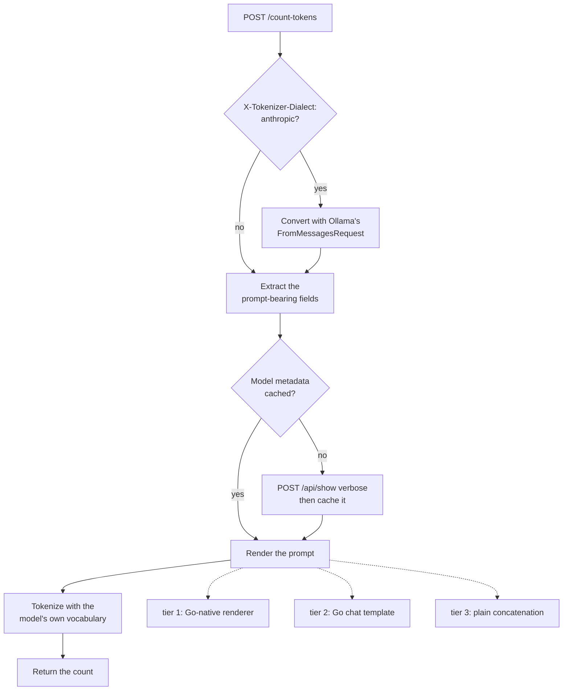

# Ollama token count service

This service tells you how many input tokens a request will cost against a locally hosted Ollama model. It uses that model's own tokenizer.

It does one thing. It does not compact context, drop messages, summarize, route or run inference. Those are consumers of this primitive.

```console
$ curl -s localhost:8081/count-tokens -d '{
    "model": "gemma4:e4b",
    "messages": [{"role": "user", "content": "Explain Kubernetes."}],
    "temperature": 0.7
  }'
{"model":"gemma4:e4b","tokens":19,"estimated":true}
```

## API

`POST /count-tokens` takes arbitrary JSON. The only required field is `model`.

The service recognizes and counts the prompt-bearing fields: `messages`, `input`, `instructions`, `system`, `prompt` and `tools`. It also reads `think`, because that decides whether a thinking block is rendered into the prompt. It ignores everything else, including `temperature`, `stream`, `max_tokens`, `metadata` and any field it has never heard of. It never rejects an unknown field.

| Status | Body | Cause |
|---|---|---|
| 200 | `{"model","tokens","estimated":true}` | counted |
| 400 | `{"error":"model is required"}` | no usable `model` |
| 400 | `{"error":"invalid JSON"}` | body is not a JSON object |
| 400 | `{"error":"invalid Anthropic request"}` | Anthropic dialect requested, body did not parse |
| 400 | `{"error":"unsupported Anthropic request"}` | Anthropic dialect requested, conversion failed |
| 404 | `{"error":"model not found"}` | model not installed in Ollama |
| 500 | `{"error":"..."}` | tokenizer could not be built |

`estimated` is always `true`. Even where drift measures zero today, this is not an authoritative inference count. If you need context-window safety, apply your own margin.

`GET /health` returns `{"status":"ok"}`. It checks process liveness only, and never loads a tokenizer or contacts Ollama.

## How it works

Everything comes from the installed model. There is no per-model table to maintain, and nothing is downloaded from Hugging Face. A downloaded tokenizer would be a second source of truth, free to drift from the artifact actually being served.



The three stages in words:

1. Model metadata comes from one `POST /api/show` with `verbose:true` per model. That returns the chat template, the `RENDERER` directive, the default system prompt, the capabilities and the full GGUF tokenizer vocabulary. For gemma4 the response is about 12MB, so the service caches it for the process lifetime.
2. Rendering runs in three tiers, highest fidelity first: the model's Go-native renderer through Ollama's `model/renderers`, then the model's Go chat template through Ollama's `template` package, then plain concatenation of the extracted text. A tier that is unavailable or errors falls to the next, so a count always comes back. The service logs which tier it used.
3. Tokenizing hands the vocabulary to Ollama's `tokenizer` package, which selects byte-pair, SentencePiece or WordPiece from `tokenizer.ggml.model`. No tokenization algorithm is reimplemented here.

Tokenizing is CPU work. The service never loads weights into VRAM, and never runs generation to get a count.

### Caching

One in-memory cache holds both the rendering metadata and the built tokenizer, keyed by exact model ID. Concurrent first requests for a model share a single load. The service does not cache failures, so a model pulled after a 404 works on the next request.

Budget roughly 75MB per cached model, once the vocabulary's lookup maps are built. Measured RSS on the Spark was 154MB with both `gemma4:e4b` (262k tokens, 515k merges) and `muse-glimmer` (202k tokens, 440k merges) cached. With a bounded set of installed models this stays well inside the unit's 4G cap.

There is no eviction, no invalidation and no persistence. Restarting empties the cache, which is fine.

## Accuracy

Measured against Ollama's real `prompt_eval_count` on the Spark, across the five request shapes in the parity harness:

| Model | Renders via | Worst drift |
|---|---|---|
| `gemma4:e4b` | renderer `gemma4` | 0.0% |
| `gemma4:26b` | renderer `gemma4` | 0.0% |
| `muse-glimmer:latest` | renderer `glimmer` | 0.0% |
| `gpt-oss:20b` | Go template | 0.0% |
| `qwen2.5-coder:7b` | Go template | -0.5%, one token, tools shape |
| `qwen3:4b-instruct-2507` | Jinja template, see below | -64.7% |

### Known gap in Jinja chat templates

Ollama 0.32.8 stores some models' chat templates in Jinja rather than Go, and renders those inside llama.cpp. It has no Go Jinja engine to reuse. Those templates fail `template.Parse` here, so the models fall to plain concatenation and are undercounted by 30% to 65%.

Of the models installed on the Spark this affects `qwen3:4b-instruct-2507` only. The Muse and Gemma models this service was built for are unaffected. You can spot a model on this path in the logs as `render_tier=concat`, with a `render_fallback` explaining why.

Closing the gap means adding a Go Jinja engine such as `gonja`, and accepting the compatibility risk around the Jinja features these templates use: `namespace`, slice syntax such as `messages[::-1]`, and the `tojson` filter. That is a real dependency, so it is deliberately out of this version.

Check the render tier before you trust a new model's counts. The compaction proxy's native Claude policies depend on them.

## Configuration

| Variable | Default | What it controls |
|---|---|---|
| `OLLAMA_URL` | `http://127.0.0.1:11434` | Ollama endpoint |
| `LISTEN_ADDR` | `:8080` | listen address; the unit sets `:8081` |
| `LOG_LEVEL` | `info` | one of `debug`, `info`, `warn`, `error` |

## Anthropic Messages callers

Send `X-Tokenizer-Dialect: anthropic` to `/count-tokens`. The service then converts the body with Ollama's `anthropic.FromMessagesRequest` before rendering. Tools become native function schemas, tool calls and results keep their structure, and system and thinking conversion follows the inference endpoint.

Without the header, the generic extractor still serves existing Ollama and OpenAI callers. Generic flattening loses tool names, tool schemas, call and result structure, and thinking blocks. One tool-bearing request measured 271 tokens flattened and 344 tokens in Anthropic dialect.

The compaction proxy sets this header for all Anthropic counting. The Ollama module is pinned to 0.34.0-rc3 to match the current Spark daemon.

Counts stay estimates. Inference usage is authoritative, and parity measurements must include both cached and non-cached input tokens.

## Logging

Structured JSON goes to stderr, one line per request. Each line carries the model, token count, tokenizer cache hit or miss, tokenization algorithm, render tier, whether thinking was on, duration, and any media-block count or render fallback.

Prompt, message and tool content are never logged, at any level. Only shapes, counts and timings.

## Development

```console
go test ./... -race          # unit tests, no Ollama needed
go build ./...
```

The unit tests run against a fake Ollama with a synthetic byte-level vocabulary. They need neither a running Ollama nor model weights.

### Parity harness

```console
OLLAMA_URL=http://192.168.69.28:11434 go test -tags parity ./internal/parity/ -v
PARITY_MODELS=gemma4:e4b,muse-glimmer:latest go test -tags parity ./internal/parity/ -v
```

This loads real models and prints the drift table above. It never fails on non-zero drift. Its job is to characterize the estimator, not to gate it.

It gets actual counts with a `num_predict: 0` chat call and reads `prompt_eval_count`. That is a measurement for the harness only. The service itself must never get a count that way.

When drift appears, diff the rendered prompt against Ollama's own using the `_debug_render_only` request option. That option is underscore-prefixed and unstable, so treat it as a debugging aid. Production counts never go through it.

## Deployment

The service runs as a systemd daemon on the Spark, beside Ollama:

```console
./deploy/deploy.sh              # defaults to 192.168.69.28
```

The script cross-compiles a static `linux/arm64` binary, installs it and the unit, and waits for `/health`. The Spark has no Go toolchain, and needs none.

Deploy this service before the compaction proxy when both have changed. The proxy's Anthropic-dialect counting depends on the dialect header landing here first.

```console
ssh 192.168.69.28 'systemctl status ollama-tokenizer'
ssh 192.168.69.28 'journalctl -u ollama-tokenizer -f'
```

The unit runs as the `ollama` user with no filesystem access to model blobs. Everything arrives over HTTP.
